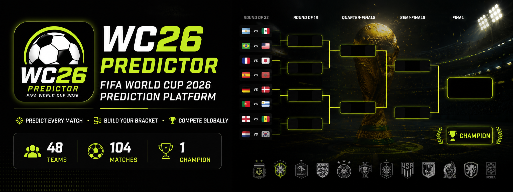

<p align="center">
  
</p>

<h1 align="center">⚽ WC26 Predictor</h1>

<p align="center">
  FIFA World Cup 2026 Prediction Platform
</p>

<p align="center">
Predict Every Match • Build Your Bracket • Compete Globally
</p>

<p align="center">
  
  
  
  
  
</p>

## 🌍 Live Demo

**Application:** https://world-cup-picks-20.emergent.host/

---

## 📖 Overview

WC26 Predictor is a full-stack FIFA World Cup 2026 prediction platform that allows football fans to:

* Predict every World Cup fixture
* Track live tournament results
* Generate knockout-stage pathways
* Build a personal World Cup bracket
* Compete on a global leaderboard
* View AI-powered match insights
* Automatically advance teams through knockout rounds
* Predict the World Cup Champion

The platform supports the official FIFA World Cup 2026 format:

```text
48 Teams
↓
12 Groups
↓
Round of 32
↓
Round of 16
↓
Quarter Finals
↓
Semi Finals
↓
Third Place Match
↓
Final
```

---

## 🚀 Features

### 🏟 Match Centre

* World Cup countdown timer
* Latest results
* Upcoming fixtures
* Tournament statistics
* Stadium information
* Match venues and kickoff times

### 🎯 Prediction Engine

* Predict all group-stage matches
* Predict all knockout matches
* Auto-save predictions
* Prediction lockouts 1 hour before kickoff
* Local timezone support

### 🤖 AI Match Insights

Every match includes:

* Home win probability
* Draw probability
* Away win probability
* AI-generated analyst brief

### 🏆 Dynamic Tournament Bracket

* Round of 32
* Round of 16
* Quarter Finals
* Semi Finals
* Final
* Third Place Match

Supports:

* Real Tournament Mode
* My Predictions Mode

### 📈 Leaderboard

Scoring system:

| Prediction Type      | Points |
| -------------------- | ------ |
| Exact Score          | 3      |
| Correct Result       | 1      |
| Incorrect Prediction | 0      |

Leaderboard tracks:

* Rank
* Total Points
* Exact Predictions
* Correct Results
* Accuracy %

### 👤 User Profiles

* Prediction history
* Current ranking
* Champion selection
* Accuracy tracking

---

## 🏗 Architecture

```text
Frontend (Next.js + React)
        │
        ▼
API Layer
        │
        ▼
Supabase PostgreSQL
        │
        ▼
World Cup Data APIs
```

---

## 🛠 Technology Stack

### Frontend

* Next.js
* React
* TypeScript
* Tailwind CSS
* ShadCN UI
* Framer Motion

### Backend

* Node.js
* Next.js API Routes

### Database

* Supabase PostgreSQL

### Authentication

* Supabase Auth
* Email Login
* Google Login

---

## 🌐 Data Sources

Matches

https://worldcup26.ir/get/games

Groups

https://worldcup26.ir/get/groups

Teams

https://worldcup26.ir/get/teams

Stadiums

https://worldcup26.ir/get/stadiums

---

## 🧠 Core Logic

### Group Stage Qualification

Automatically calculates:

* Group Winners
* Group Runners-Up
* Best Third-Placed Teams

### Knockout Progression

Winners automatically advance through:

```text
Round of 32
→ Round of 16
→ Quarter Finals
→ Semi Finals
→ Final
```

### Match Locking

Predictions are automatically locked:

```text
Kickoff Time - 1 Hour
```

---

## 📸 Screenshots

### Match Centre


### Predictions


### Bracket


### Leaderboard


---

## ⚙️ Installation

Clone repository:

```bash
git clone https://github.com/Ankan2508/Fifa-WC26-Score-Predictor.git
```

Navigate:

```bash
cd Fifa-WC26-Score-Predictor
```

Install packages:

```bash
npm install
```

Run locally:

```bash
npm run dev
```

---

## 🔐 Environment Variables

Create:

```env
NEXT_PUBLIC_SUPABASE_URL=
NEXT_PUBLIC_SUPABASE_ANON_KEY=
SUPABASE_SERVICE_ROLE_KEY=
```

---

## 📌 Roadmap

### Current

* Match Centre
* Predictions
* Dynamic Bracket
* Leaderboard
* Authentication
* AI Match Insights

### Upcoming

* Mini Leagues
* Friend Challenges
* Champion Sharing
* Achievement Badges
* Mobile App
* Push Notifications

---

## 🤝 Contributing

Contributions are welcome.

Feel free to:

* Open Issues
* Submit Pull Requests
* Suggest Features
* Report Bugs

---

## 📄 License

MIT License

---

## 👨‍💻 Author

**Ankan Bandyopadhyay**

Data Analyst | Power BI Developer | Sports Analytics Enthusiast

GitHub:
https://github.com/Ankan2508

LinkedIn:
(Add your LinkedIn profile)

---

⭐ If you like this project, please consider giving it a star.
